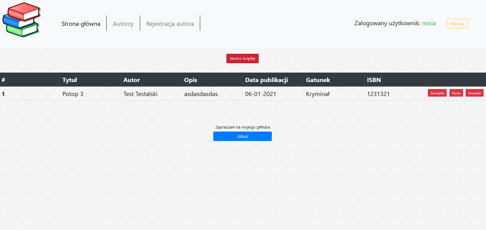
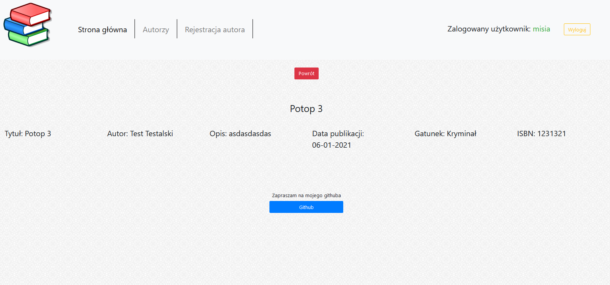
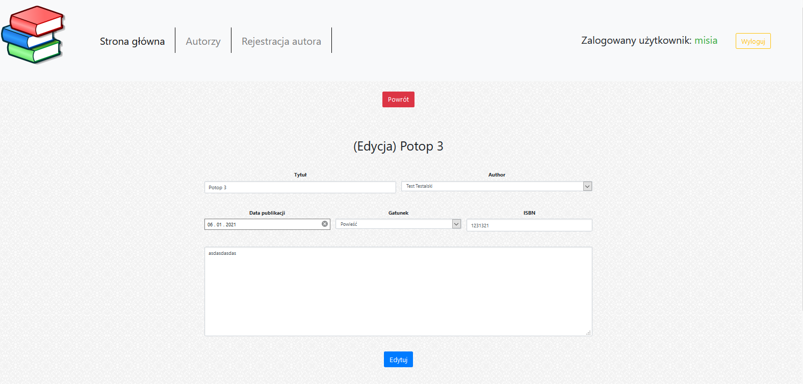
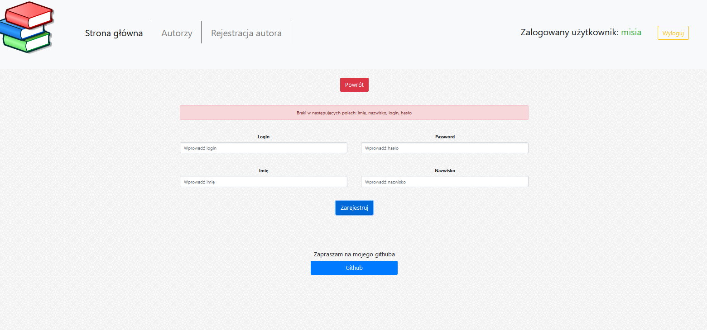
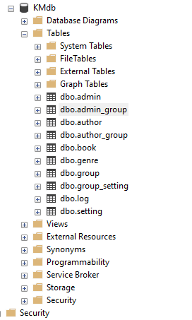
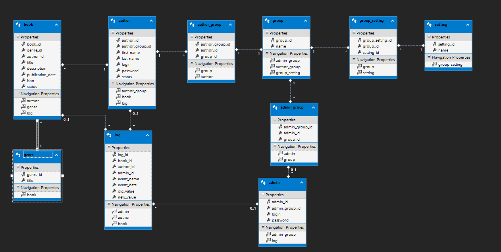
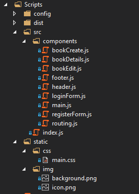
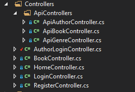
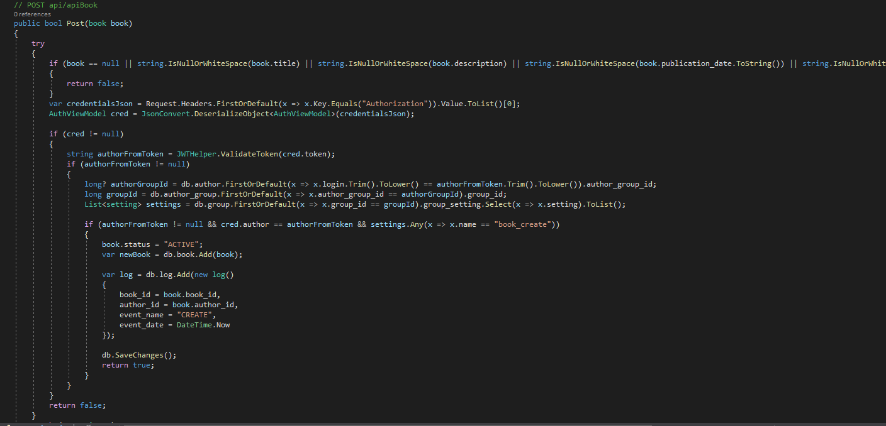

# BooksApp in .NET Framework with MS SQL and React.js

This is simple application presenting information about authors, books, genres. Access to them is restricted by JWT authentication and priviliges saved in DB. The author can 
register and log in and then he has CRUD capabilities. Request are sent from React.js to REST Api made in .NET Framework. I used DB first approach.

**The goal was to:**
- practice backend skills with .NET Framework and MS SQL
- practice frontend skills with React.js and Bootstrap
- get familiar with Webpack and Babel
- practicing JWT authentication

## Used technologies:
- C#, .NET Framework
- MS SQL
- React.js
- Babel, Webpack
- HTML, CSS, JS, Bootstrap

## Plans for the future:
- add additional functionalities such as: search engine, ordering by pressing column name in index page
- add unit tests
- refine frontend with prime.ng or material design

## Screenshots:
Logged author

Book details

Book edit

Register author

Tables structure

EDMX structure

React components structure

Controllers structure

.NET sample code

